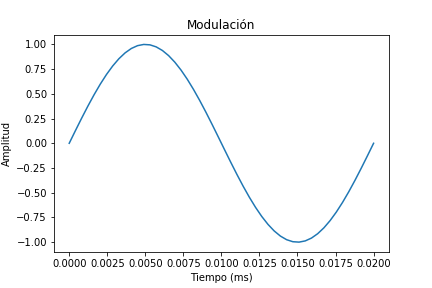
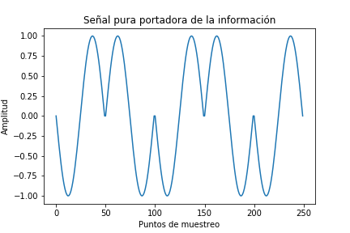
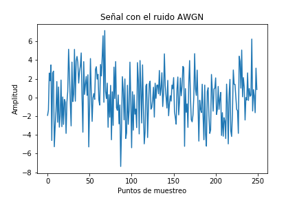
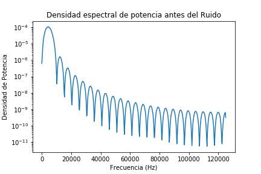
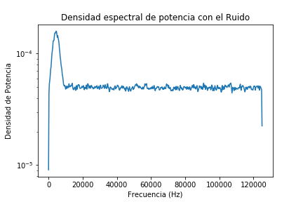
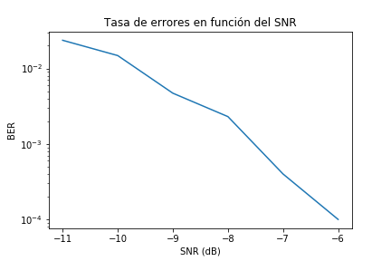

Tarea 4
Emmanuel Chavarría Solís 
B51977

1. Se creó una modulación BPSK para lo cual se le asignó una forma sinusoidal positiva si el bit es 1
y una onda sinusoidal desfasada 180 grados si el bit era cero, se eligió modular con el seno sobre
el coseno debido a que el coseno comienza en un valor de uno, por lo que si se usa esta función se
agregarían más transientes debido a los cambios de amplitud repentinos, A continuación se presenta un
ejemplo para transmitir un bit con valor de uno:

Aquí se presentan los primeros 5 Bits modulados con BPSK:

2. Se calculó la potencia promedio integrando la potencia instantánea con la función trapz, para la 
potencia instantanea se elevó al cuadrado la amplitud de la señal modulada con lo cual se obtuvo un 
valor para la potencia promedio de 0.49 aproximadamente.

3. Para la pregunta 3 se simuló un canal ruidoso en el cual se cambió los valores mencionados en el 
enunciado de la tarea por que siempre daba un BER de 0, esto debido a que el ruido no era suficiente
para generar errores en la transmisión de datos, se utilizó valores de -6dB hasta los -11dB para 
obtener un valor más cercano a lo que se obtiene en la vida real como se mencionó en consulta de la 
clase. Se realizó una visualización de la señal con el ruido de -11dB que era el más fuerte la cual 
se presenta en la siguiente Figura, los primeros 5 Bits son los que se pueden apreciar:

4. Se graficó la densidad espectral antes de que el ruido llegara a la señal, con lo cual se obtuvo 
una señal que tiene un máximo de potencia transmitida en la frecuencia de 5kHz, sin embargo tiene algunos 
transientes producidos en forma de lóbulos, por que es una combinación de señales de seno y seno desfasada 
180 grados, no es una señal  senoidal totalmente pura, además cuando hay cambio de un bit 0 a un 1 o al 
reves hay un cambio brusco que influye en los transientes de la densidad espectral, a continuación se 
presenta esta señal:

También se graficó la señal después cuando el ruido ya estaba haciendo efecto, en este caso no se
observaron estos lobulos debido a que el ruido tiene una densidad espectral más alta que los transientes
por lo tanto los opaca y solo se aprecia el pico en la frecuencia de transmisión y posteriormente la
la densidad aportada por el ruido AWGN. A continuación se presenta un ejemplo de esta señal:

5. Se demoduló la señal para todo el rango de potencias desde -11dB hasta los -6dB para los cuales 
se calculó su respectivo BER, el cual se presenta de forma gráfica en el siguiente punto y además se pueden
verificar los resultados en la consola, hay que tener presente que cada vez que se corre el código se 
obtienen resultados diferentes porque el ruido es un factor aleatorio.

6. Finalmente se presenta la gráfica del BER en función del SNR

